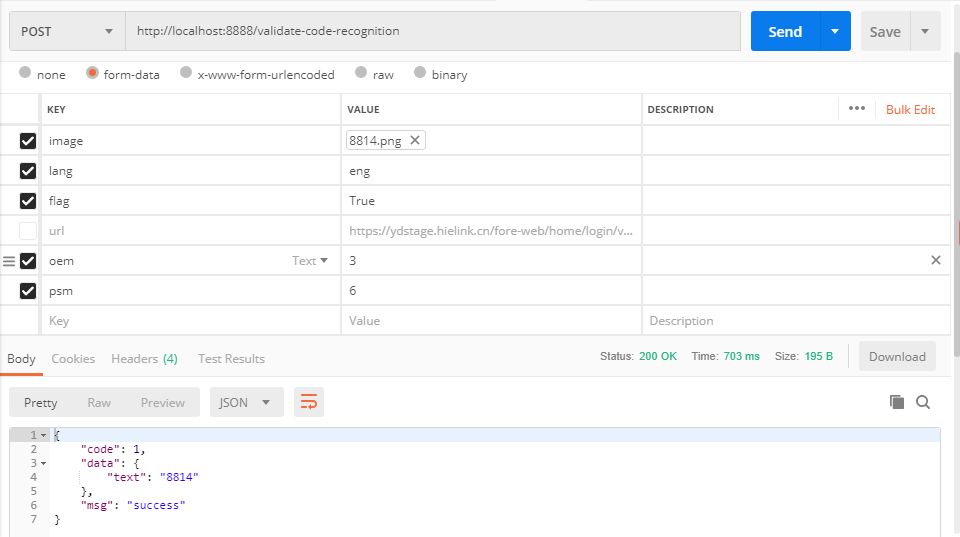

## 安装与应用

1. 克隆代码：`git clone https://github.com/lucas234/docker-tesseract `  

2. 构建`docker`镜像：`docker build -t tesseract .`

3. 运行镜像：`docker run  -itd -p 8888:5000 --name tesseract-server  tesseract`，运行后会返回一个 `container id`

4. 或者直接拉取我已经上传的`docker`镜像

5. 然后可以通过 http://localhost:8888/validate-code-recognition 来识别图片




**HTTP 方法：`POST`**

**请求URL：** `http://localhost:8888/validate-code-recognitio`

**请求参数：**

| 参数    | 是否必选          | 类型   | 描述                                                         |
| ------- | ----------------- | ------ | ------------------------------------------------------------ |
| `image` | 和`url`二选一     | file   | 当`image`字段存在时`url`字段失效                             |
| `lang`  | 否                | string | 选填，语言类型（`eng，chi_sim`等，选择其他的需要下载对应的语言数据包） |
| `flag`  | 否                | Boole  | 选填，图片是否去噪，默认不去噪                               |
| `url`   | 和`image`二选一， | string | 图片完整URL，当`image`字段存在时`url`字段失效                |
| `oem`   | 否                | int    | 范围：0-3                                                    |
| `psm`   | 否                | int    | 范围：0-13                                                   |

**返回示例：**

```json
{
    "code": 1,
    "data": {
        "text": "8814"
    },
    "msg": "success"
}
```

**请求代码示例：**

```shell
curl -X POST http://localhost:8888/validate-code-recognition -H "content-type: multipart/form-data; boundary=----WebKitFormBoundary7MA4YWxkTrZu0gW" -F "image=@C:\images\8814.png" -F flag=True -F oem=3 -F psm=6
```

```python
import requests

url = "http://localhost:8888/validate-code-recognition"
data = {
    # 'url': (None, "https://ydstage.hielink.cn/fore-web/home/login/validate-code.page"),
    'image': ("xxxx.png", open(r"C:\Users\XXX\Desktop\8814.png", "rb"), "image/jpeg"),
    'flag': (None, True),
    'oem': (None, 3),
    'psm': (None, 6)
}
response = requests.request("POST", url, files=data)
print(response.text)
# response 
# {"code":1,"data":{"text":"8814"},"msg":"success"}
```

## Tesseract 基础用法

安装Tesseract后，通过命令行查看是否安装成功：

首先运行： `docker exec -it <`container id`> sh`

然后运行：`tesseract -v`

通过以下命令识别图片：

`tesseract <test_image> <output_file_name> -l <language(s)> --oem <mode> --psm <mode> `

1. *Langue (`-l`)* – 识别图片选择的语言，可以单个或者同时多个

2. *OCR engine mode (`–oem`)* – 识别图片的引擎模式, Tesseract 4 有 LSTM 和 Legacy 引擎，但是通过`--oem`有四种模式可以选择（通过命令查看：`tesseract --help-oem`）：

   ```
   OCR Engine modes: 
     0    Legacy engine only.
     1    Neural nets LSTM engine only.
     2    Legacy + LSTM engines.
     3    Default, based on what is available.
   ```

3. *Page Segmentation Mode (`-psm`)* --可以根据图片中的文字进行调整以获得更好的识别效果，通过 `--psm` 可以选择（通过命令查看：`tesseract --help-psm`）：

   ```
   Page segmentation modes:
     0    Orientation and script detection (OSD) only.
     1    Automatic page segmentation with OSD.
     2    Automatic page segmentation, but no OSD, or OCR.
     3    Fully automatic page segmentation, but no OSD. (Default)
     4    Assume a single column of text of variable sizes.
     5    Assume a single uniform block of vertically aligned text.
     6    Assume a single uniform block of text.
     7    Treat the image as a single text line.
     8    Treat the image as a single word.
     9    Treat the image as a single word in a circle.
    10    Treat the image as a single character.
    11    Sparse text. Find as much text as possible in no particular order.
    12    Sparse text with OSD.
    13    Raw line. Treat the image as a single text line,
          bypassing hacks that are Tesseract-specific.
   ```

## Tips

1. 下载图片

   ```shell
   curl -o tmp/test.png https://img-blog.csdn.net/20170510131536346?watermark/2/text/aHR0cDovL2Jsb2cuY3Nkbi5uZXQvbGIyND
   U1NTc0NzI=/font/5a6L5L2T/fontsize/400/fill/I0JBQkFCMA==/dissolve/70/gravity/Center
   ```

2. 解决 `pip` 下载慢的问题

   ```dockerfile
   RUN pip3 config set global.index-url https://mirrors.aliyun.com/pypi/simple && pip3 config set install.trusted-host mirrors.aliyun.com
   ```

3. 切换docker源

   ```dockerfile
   # 阿里云：
   RUN sed -i 's/dl-cdn.alpinelinux.org/mirrors.aliyun.com/g' /etc/apk/repositories
   # 中国科技大学的源：
   RUN sed -i 's/dl-cdn.alpinelinux.org/mirrors.ustc.edu.cn/g' /etc/apk/repositories
   # 清华源：
   RUN sed -i 's/dl-cdn.alpinelinux.org/mirrors.tuna.tsinghua.edu.cn/g' /etc/apk/repositories
   ```

4. 语言库下载：

   - [tessdata_best](https://github.com/tesseract-ocr/tessdata_best)
   - [tessdata](https://github.com/tesseract-ocr/tessdata)
   - [tessdata_fast](https://github.com/tesseract-ocr/tessdata_fast)


## 参考：

1. [https://github.com/madmaze/pytesseract](https://github.com/madmaze/pytesseract)
2. [https://nanonets.com/blog/ocr-with-tesseract/](https://nanonets.com/blog/ocr-with-tesseract/)
3. [OpenCV](https://www.cnblogs.com/silence-cho/p/10926248.html)
4. [https://www.pyimagesearch.com/2018/09/17/opencv-ocr-and-text-recognition-with-tesseract/](https://www.pyimagesearch.com/2018/09/17/opencv-ocr-and-text-recognition-with-tesseract/)
5. [基于tesseract的封装](https://github.com/sirfz/tesserocr)：[用法](https://medium.com/better-programming/beginners-guide-to-tesseract-ocr-using-python-10ecbb426c3d)


